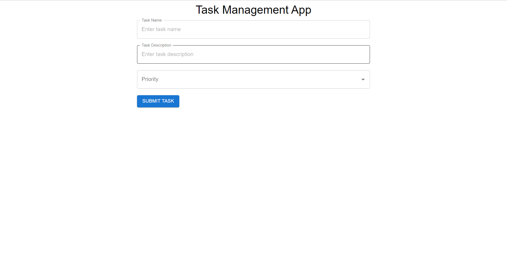
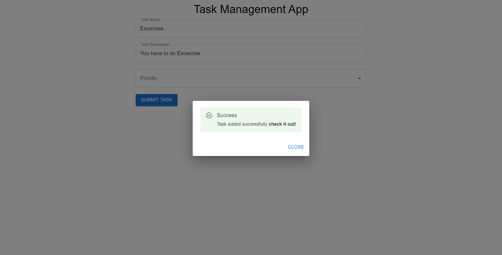
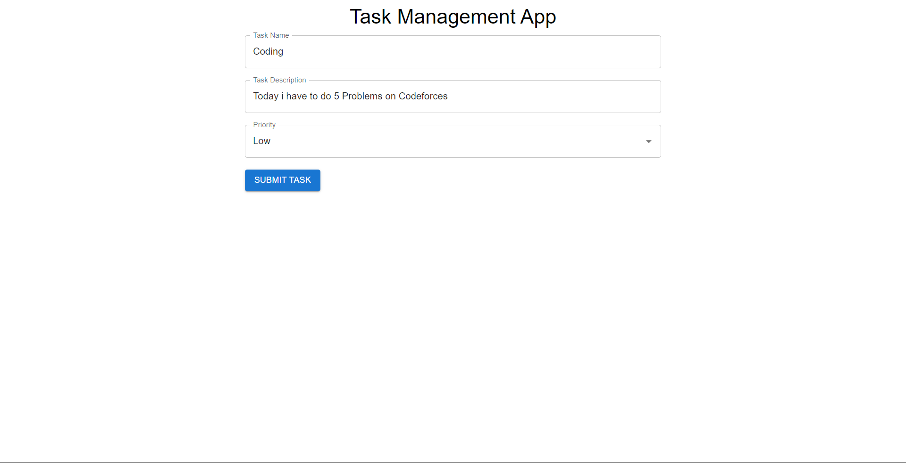
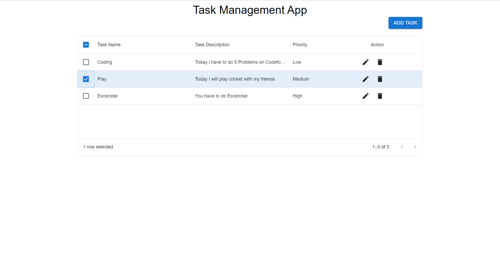

Live Project: https://task-manangement-app.vercel.app/

# Running a React Project from GitHub Locally
This guide provides steps to set up and run a React project from GitHub on your local machine.

# Prerequisites
* Node.js and npm installed on your system.
* Git installed to clone the repository.

# Steps:
1. Clone the Repository:  
Open your terminal or command prompt and clone the GitHub repository using `git clone <repository_url>`  
2. Navigate to the Project:  
Change your current directory to the cloned project folder using `cd <project_folder_name>`  
3. Install Dependencies:  
Use npm or yarn to install the project dependencies using `npm install`  
4. Start the Development Server:  
Run the development server to launch the React application using `npm start`

# Screenshots

  
  
  
  

